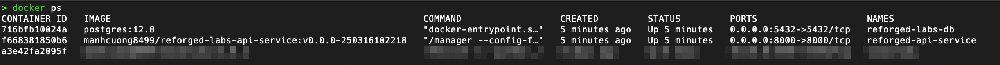
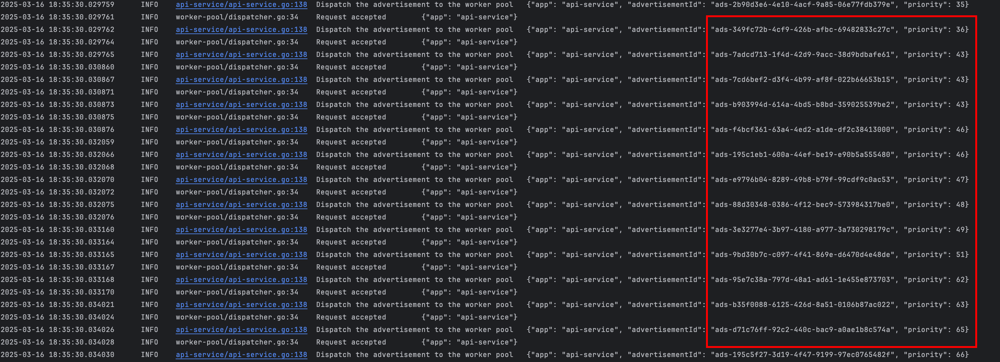
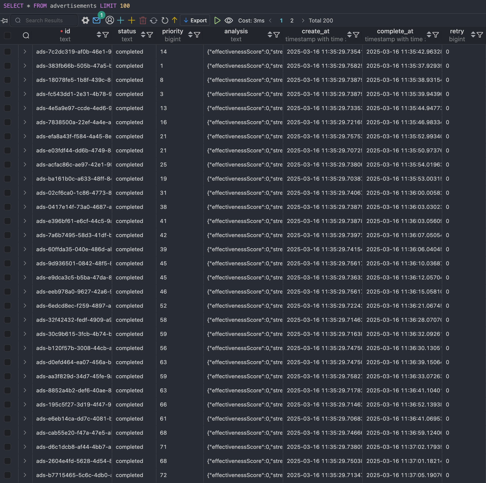

# reforged-labs

<hr>

###### 🌈 Table of contents

1. [Environment](#environment)
2. [Deployment](#deployment)
3. [Project details](#project-details)
4. [API details](#api-details)<br>
   4.1. [POST - `/api/v1/ads`](#post---apiv1ads-create-a-new-advertisement)<br>
   4.2. [GET - `/api/v1/ads/:ads_id`](#get---apiv1adsads_id-get-an-advertisement-by-id)
5. [Enhancements](#enhancements)
6. [Demonstration](#demonstration)

<hr>

# Environment

- GoLang 1.24.1
- MacOS 15.3, Ubuntu 24.04.1 LTS
- Docker Desktop (MacOS) or Docker Engine (Ubuntu)

# Deployment

- Clone this repository to your local machine:
    ```bash
    git clone https://github.com/cuongpiger/reforged-labs.git --depth 1 && cd reforged-labs
    ```

- Run the below command to deploy both PostgreSQL and API service:
    ```bash
    docker compose up -d
    ```

- Verify the deployment:
    ```bash
    docker ps
    ```
  You should see 2 containers running:
  

# Project details

- This application uses PostgreSQL as the database.
    - Using ORM to interact with the database.
    - The database used to store the Advertisement data.

- About the web-framework:
    - Using `gin-gonic` as the web-framework.
    - The API is RESTful.

- Following Clean Architecture principles.
    - The application is divided into 3 layers: `domain`, `usecase`, and `delivery`.
    - The `domain` layer contains the business logic.
    - The `usecase` layer contains the application logic.
    - The `delivery` layer contains the API logic.

# API details

## POST - `/api/v1/ads`: Create a new advertisement

- This feature workflow includes 2 parts:
    - A memory priority queue to store the advertisement data. Assume that advertisement with lower priority value will
      be processed first.
        - To implement this feature, I use the `container/heap` package in GoLang.
        - GoLang Mutex is used to lock the queue when adding or removing an item.
        - Signal is used to notify the worker when a new item is added to the queue.
    - Worker pool to process the advertisement data.
        - The worker pool is implemented using GoLang goroutines.
        - The worker pool is started when the application starts.
        - The worker pool will process the advertisement data whenever a new item is added to the queue.
        - The worker pool will process the advertisement data based on the priority value.
        - I use two design patterns: `Chain` and `WorkerPool` to implement this feature.

- Example using `curl`:
  ```bash
  curl --location 'http://127.0.0.1:8000/api/v1/ads' \
  --header 'Content-Type: application/json' \
  --data '{
  "title": "Dragon Kingdom: Rise to Power",
  "description": "Build your kingdom, train your dragons, and conquer new territories!",
  "genre": "Strategy",
  "targetAudience": [
  "18-34",
  "Strategy Gamers"
  ],
  "visualElements": [
  "Dragons",
  "Castle",
  "Battle Scenes"
  ],
  "callToAction": "Download Now & Claim 1000 Free Gems!",
  "duration": 30,
  "priority": 2
  }'
  ```

## GET - `/api/v1/ads/:ads_id`: Get an advertisement by ID

- The workflow simply retrieves the advertisement data from PostgreSQL database by advertisement ID.
- Example using `curl`:
    ```bash
     curl --location 'http://127.0.0.1:8000/api/v1/ads/ads-9e4c9414-4cdb-4fb6-929e-6111c3b83ee9'
    ```

# Enhancements

- With this design, we can only run 1 service at the same time. Because if more than 1, the consistency of the data
  will be affected. The root cause is that we need to process the advertisement data based on the priority value.
- Can not scale the application horizontally.
- Not ensure high availability.
- Solutions:
    - To enhance this feature, we can use a message queue system like RabbitMQ or Kafka to process the advertisement
      data
      asynchronously. In my opinion, I prefer RabbitMQ because it supports the `priority` feature.
    - Split the application into 2 services: `API service` and `Worker service`.

# Demonstration

- My scenario is to make 200 requests to the API service to create 200 advertisements. The body of the request is
  generated randomly.
- In the logs, we can see that the worker pool processes the advertisement data based on the priority value.

- I prepared a go script to make 200 requests to the API service. You can run the below command to start the script:
    ```bash
    go run ./test/main.go
    ```

- The logs of the API service:
  

- You realize that the worker pool processes the advertisement data based on the priority value. The advertisement with
  the lower priority value will be processed first. For each advertisement, I randomly sleep the worker for a few seconds to simulate the processing time.
- The advertisement status will be updated through these states: `submitted`, `queued`, `processing` and finally `completed`.
- This is the screenshot of the Advertisement table in the PostgreSQL database:
  
